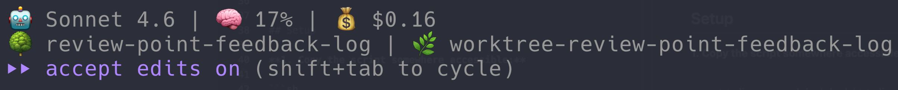

# Claude Code Statusline

A custom statusline script for [Claude Code](https://claude.ai/claude-code) that displays real-time session information in your terminal.



## What It Shows

```
🤖 Claude Sonnet 4.6 | 🧠 12% | 💰 $0.04
🌳 my-feature | 🌿 main +42 -7
```

| Field | Description |
|---|---|
| 🤖 Model | Active Claude model name |
| 🧠 Context | Context window usage percentage |
| 💰 Cost | Cumulative session cost in USD |
| 🌳 Worktree | Active git worktree name |
| 🌿 Branch | Current git branch with lines added/removed |

## Prerequisites

- [Claude Code](https://claude.ai/claude-code) CLI installed
- [`jq`](https://jqlang.github.io/jq/) — for parsing the JSON input from Claude Code
- `git` — for branch and diff stats

Install `jq` if needed:

```sh
# macOS
brew install jq

# Ubuntu/Debian
apt-get install jq
```

## Setup

**1. Copy the script somewhere accessible:**

```sh
cp statusline-command.sh ~/.claude/statusline-command.sh
chmod +x ~/.claude/statusline-command.sh
```

**2. Add the statusline configuration to `.claude/settings.json`:**

For a **global** setup (applies to all projects), edit `~/.claude/settings.json`:

```json
{
  "statusLine": {
    "type": "command",
    "command": "sh ~/.claude/statusline-command.sh",
    "padding": 0
  }
}
```

For a **project-level** setup, add the same block to `.claude/settings.json` in your project root.

**3. Start Claude Code** — the statusline will appear automatically.

## Customization

The script reads a JSON object from stdin with the following fields:

| Field | Description |
|---|---|
| `model.display_name` | Name of the active model |
| `context_window.used_percentage` | Context usage as a float |
| `worktree.name` | Active worktree name |
| `cost.total_cost_usd` | Session cost |
| `cost.total_lines_added` | Lines added this session |
| `cost.total_lines_removed` | Lines removed this session |
| `workspace.current_dir` | Current working directory |

Edit `statusline-command.sh` to change the format, add new fields, or adjust colors.
